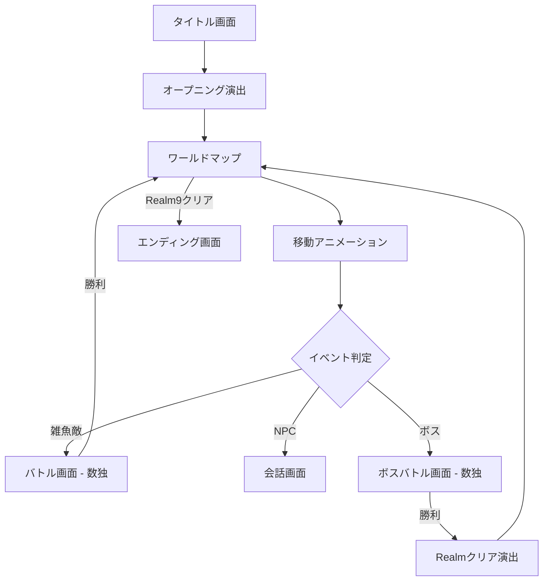

# 機能設計書 - Nine Realms

## 画面構成・遷移図



## シーン一覧

| シーン名 | 役割 |
|---|---|
| BootScene | アセット読み込み |
| TitleScene | タイトル画面・セーブデータ確認 |
| OpeningScene | オープニングテキスト演出 |
| WorldMapScene | ワールドマップ表示・移動 |
| DialogScene | NPC会話・ストーリーテキスト |
| BattleScene | 数独パズル + バトルUI |
| RealmClearScene | Realmクリア演出 |
| EndingScene | エンディング |

## ワールドマップ設計

### Realm一覧

| Realm | エリア名 | 敵の強さ | 数独難易度 |
|---|---|---|---|
| 1 | 草原の王国 | ★☆☆☆☆ | 超簡単（空白20個） |
| 2 | 森の王国 | ★★☆☆☆ | 簡単（空白25個） |
| 3 | 砂漠の王国 | ★★☆☆☆ | 簡単（空白30個） |
| 4 | 雪山の王国 | ★★★☆☆ | 普通（空白35個） |
| 5 | 海の王国 | ★★★☆☆ | 普通（空白40個） |
| 6 | 火山の王国 | ★★★★☆ | 難しい（空白45個） |
| 7 | 闇の森 | ★★★★☆ | 難しい（空白50個） |
| 8 | 天空の王国 | ★★★★★ | 超難しい（空白55個） |
| 9 | 魔王城 | ★★★★★ | 最難関（空白60個） |

### マップ移動

- 勇者アイコンがRealm間を移動するアニメーション
- 未クリア：グレーアウト
- クリア済み：明るく表示・チェックマーク

## バトルシステム設計

### バトルフロー

```
1. 敵出現アニメーション
2. 敵のセリフ表示
3. 数独グリッド表示
4. プレイヤーが数独を解く
5. 正解判定
   - 正解 → 勝利演出 → マップへ戻る
   - 不正解（ミス3回） → ヒントを提供（ペナルティなし）
```

### 数独UI

- 9×9グリッド
- 選択セルをハイライト
- 同じ数字を薄くハイライト
- ミスを赤くマーク
- メモ機能（小さな数字を入力）
- 残り空白数の表示

### 敵キャラクター

| 種類 | 出現場所 | 数独難易度 |
|---|---|---|
| 雑魚敵 | Realm内の道中 | Realm難易度と同等 |
| ボス | Realm最後 | Realm難易度 +1段階 |

## ストーリーテキスト設計

### オープニング（OpeningScene）

```
「遥か昔、この世界は一つだった。
しかし魔王ナインが現れ、世界を9つのRealm（王国）に引き裂いた。
各Realmは魔王の手下に支配され、人々は苦しんでいる。
あなたは伝説の数術師の血を引く勇者。
9つのRealmを解放し、魔王ナインを倒せ！」
```

### NPC（Realm1入り口の村人）

```
「旅人よ、よく来てくれた。
この世界には9つのRealm（王国）がある。
それぞれのRealmにはボスが君臨しており、
数の謎（数独）を解かねば先には進めない。
気をつけて旅を続けてくれ。」
```

## HPとダメージシステム設計

### HP設定

| Realm | 基本HP |
|---|---|
| 1〜3 | 100 |
| 4〜6 | 150 |
| 7〜8 | 200 |
| 9 | 250 |

防具・アクセサリーの装備でHP増加。

### ダメージ設定

| ダメージ種類 | 発生タイミング | ダメージ量 |
|---|---|---|
| 時間ダメージ | 10秒ごと | 5ダメージ（アクセサリーで軽減可） |
| ミスダメージ | 間違い入力ごと | 10ダメージ（アクセサリーで軽減可） |

### HP0時の処理
- バトル失敗演出（敵の勝利セリフ）
- ワールドマップに戻る
- ゴールド・アイテムの消費はなし（ペナルティなし）
- 再挑戦可能

## 装備システム設計

### 装備部位と効果

| 部位 | 効果例 |
|---|---|
| 武器 | 空白マス -5〜-15（強い武器ほど減る） |
| 防具 | 最大HP +50〜+150 |
| アクセサリー | 時間ダメージ -1〜-3 / ミスダメージ -3〜-5 |

### 装備一覧（案）

| 名前 | 部位 | 効果 | 入手方法 |
|---|---|---|---|
| 木の剣 | 武器 | 空白マス -5 | ショップ 100G |
| 鉄の剣 | 武器 | 空白マス -10 | Realm3ボスドロップ |
| 伝説の剣 | 武器 | 空白マス -15 | Realm7ボスドロップ |
| 革の鎧 | 防具 | 最大HP +50 | ショップ 150G |
| 鉄の鎧 | 防具 | 最大HP +100 | Realm5ボスドロップ |
| 守護の鎧 | 防具 | 最大HP +150 | Realm8ボスドロップ |
| お守り | アクセサリー | 時間ダメージ -1 | ショップ 80G |
| 賢者の指輪 | アクセサリー | ミスダメージ -5 | Realm4ボスドロップ |
| 不死鳥の羽 | アクセサリー | 時間ダメージ -3 | Realm9ボスドロップ |

## ショップ設計

### 配置
ワールドマップ上に共通ショップを1つ配置。いつでもアクセス可能。

### ゴールド獲得
- 雑魚敵撃破: 10〜20G（Realm難易度に応じて増加）
- ボス撃破: 50〜100G（Realm難易度に応じて増加）

### アイテム一覧

| アイテム | 効果 | 価格 | 使い捨て |
|---|---|---|---|
| 数字の光 | バトル中、選択中のマスに入る可能性のある数字を表示 | 10G | ✓ |
| 真実の目 | バトル中、間違って入力されているマスをすべてハイライト | 30G | ✓ |
| 導きの手 | バトル中、空白マスを1つ自動で正解入力 | 50G | ✓ |

### バトル中のアイテム使用UI
- バトル画面下部にアイテムスロット表示
- 所持アイテムのみ使用可能（なければグレーアウト）

## データ設計

### セーブデータ（LocalStorage）

```typescript
interface SaveData {
  currentRealm: number;        // 現在のRealm（1〜9）
  clearedRealms: number[];     // クリア済みRealm番号
  totalSolvedCount: number;    // 解いた数独の総数
  gold: number;                // 所持ゴールド
  hp: number;                  // 現在HP
  maxHp: number;               // 最大HP
  equipment: {
    weapon: string | null;     // 装備中の武器ID
    armor: string | null;      // 装備中の防具ID
    accessory: string | null;  // 装備中のアクセサリーID
  };
  inventory: string[];         // 所持装備IDリスト
  items: {
    numberLight: number;       // 数字の光 所持数
    truthEye: number;          // 真実の目 所持数
    guidingHand: number;       // 導きの手 所持数
  };
}
```

### 数独パズルデータ

```typescript
interface SudokuPuzzle {
  grid: number[][];    // 9x9の初期盤面（0=空白）
  solution: number[][]; // 解答
  difficulty: number;  // 空白数
}
```

## 変更履歴

- 2026-03-24: 初版作成
